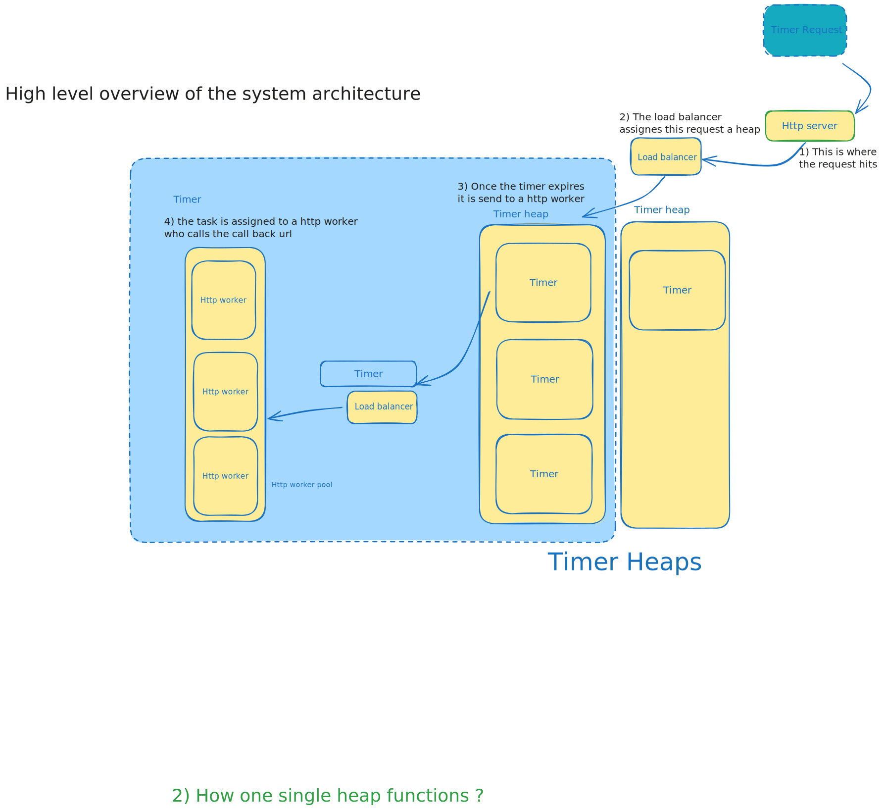
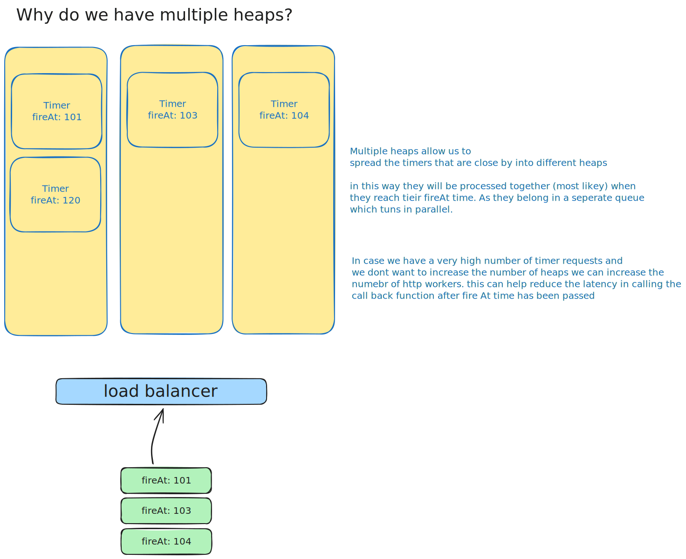
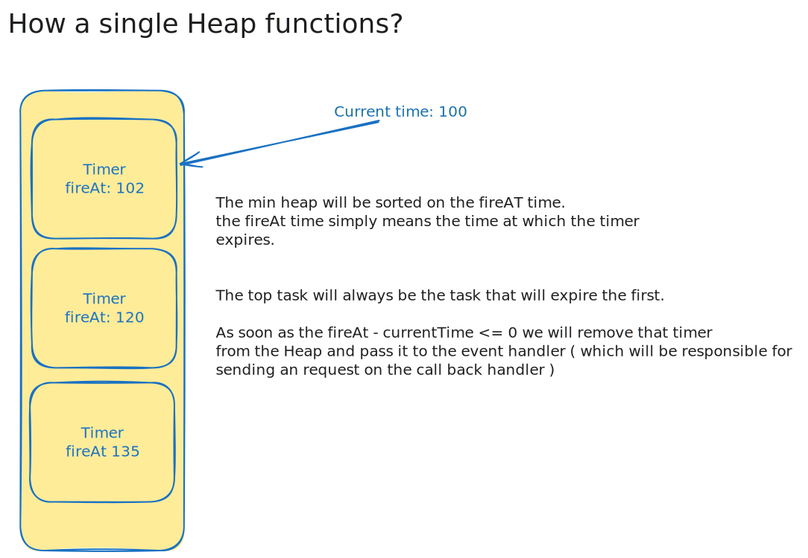

# Timer Architecture

This document describes the design and internal structure of `atimer`.

## Core Components

`atimer` is built on a sharded, multi-queue architecture to avoid lock contention under high load:

### 1. Timer
The orchestrator struct. It manages a slice of `TimerHeap` instances.
When a task is added via `AddTask()`, `Timer` uses `sync/atomic` to increment an index and route the task to a heap in a round-robin fashion. This distributes lock contention across multiple heaps.

> Something regarding the multi heap design

### 2. TimerHeap
A wrapper around the custom min-heap implementation (`TimerTaskHeap`).
- Each heap runs its own background runner loop `Run()`.
- **Mutex Protection**: Protects task operations (`Push`, `Pop`, `Peek`) using a local `sync.Mutex` lock.
- **Sleep & Signal**: Uses a `taskAdded` channel to signal the background runner loop when a new task is pushed. The runner loop uses `time.NewTimer` to sleep efficiently until either the next task expires or a new task is added (waking it up early to re-evaluate the closest expiration candidate).

> Below is an naive understanding of the working of the heap 

### 3. TimerEventHandler
A worker pool system associated with each heap.
- Spins up a configurable number of background worker goroutines.
- Reads expired tasks from an internal buffered channel (`EventQueue`) and shoots HTTP POST requests using a reusable `http.Client`.

---

## Whiteboard Illustration
You can inspect the design whiteboard schematic:
- System Whiteboard: [whiteboard.excalidraw](../whiteboard.excalidraw)
